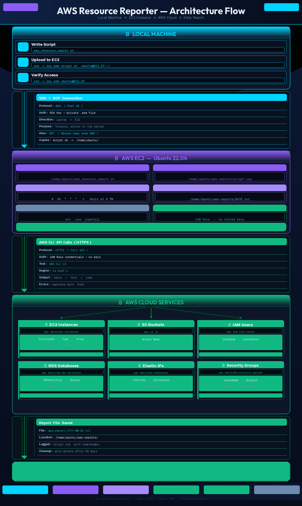
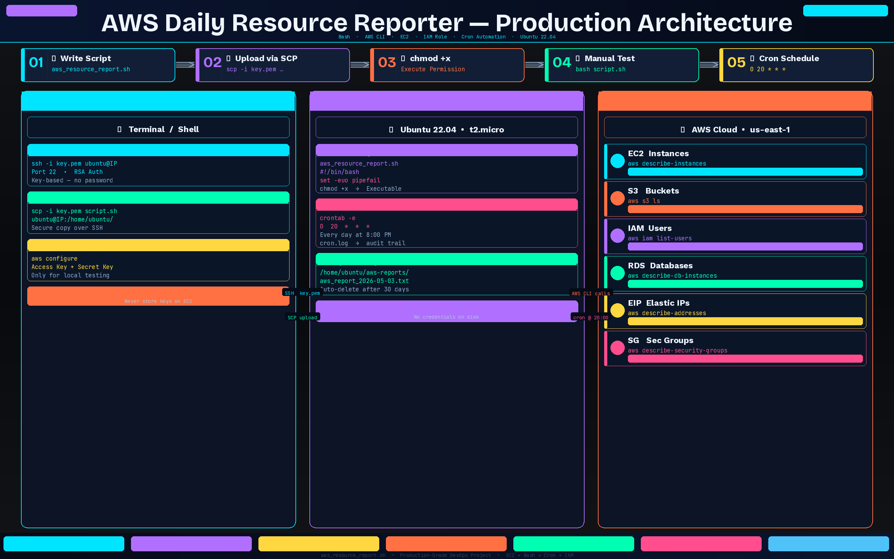

# AWS Daily Resource Reporter 🚀

> A production-grade Bash script deployed on AWS EC2 that automatically
> generates daily reports of AWS resource usage — every day at 8 PM.



---

## What This Script Reports

| AWS Service | Data Collected |
|-------------|---------------|
| 🖥 EC2 Instances | ID, Type, State, Public IP, Name |
| 🪣 S3 Buckets | Name, Creation Date |
| 👤 IAM Users | Username, Created Date, Last Login |
| 🗄 RDS Databases | ID, Engine, Version, Status, Class |
| 🌐 Elastic IPs | Public IP, Instance ID, Allocation |
| 🛡 Security Groups | Name, ID, VPC, Description |

---

## How It Works

```
Your Laptop
    │
    │  SSH + SCP (key.pem)
    ▼
EC2 Instance (Ubuntu 22.04)
    │
    │  Cron runs every day at 8 PM
    │  AWS CLI makes API calls
    ▼
/home/ubuntu/aws-reports/aws_report_YYYY-MM-DD.txt
```

---

## Prerequisites

Before starting make sure you have:

- AWS Account with EC2 instance running (Ubuntu 22.04)
- SSH key pair `.pem` file downloaded
- AWS CLI installed on EC2
- IAM Role with `ReadOnlyAccess` attached to EC2

---

## Quick Start — Step by Step

### Step 1 — Clone this repository

```bash
git clone https://github.com/YOUR_USERNAME/aws-resource-reporter.git
cd aws-resource-reporter
```

### Step 2 — Upload script to EC2

```bash
scp -i /path/to/key.pem aws_resource_report.sh ubuntu@YOUR_EC2_IP:/home/ubuntu/
```

### Step 3 — SSH into EC2

```bash
ssh -i /path/to/key.pem ubuntu@YOUR_EC2_IP
```

### Step 4 — Give execute permission

```bash
chmod +x /home/ubuntu/aws_resource_report.sh
```

### Step 5 — Test run manually

```bash
bash /home/ubuntu/aws_resource_report.sh
```

Expected output:
```
============================================
   AWS DAILY RESOURCE USAGE REPORT
   Date   : 2026-05-03
   Time   : 20:00:01
   Region : us-east-1
============================================
```

### Step 6 — Schedule with cron

```bash
# Open cron editor
crontab -e

# Add this line at the bottom
0 20 * * * /bin/bash /home/ubuntu/aws_resource_report.sh >> /home/ubuntu/aws-reports/cron.log 2>&1
```

### Step 7 — Verify cron is set

```bash
crontab -l
```

---

## Check Your Reports

```bash
# List all saved reports
ls -lh /home/ubuntu/aws-reports/

# Read today's report
cat /home/ubuntu/aws-reports/aws_report_$(date +%Y-%m-%d).txt

# Check script log
cat /home/ubuntu/aws-reports/script.log
```

---

## Security

```bash
# ❌ Do NOT do this — stores keys on disk
aws configure

# ✅ Do this instead — attach IAM Role to EC2
# AWS Console → EC2 → Actions → Security → Modify IAM Role
# No keys stored anywhere on the server
```

---

## Troubleshooting

| Problem | Fix |
|---------|-----|
| `Permission denied` | Run `chmod +x script.sh` |
| `aws: command not found` | Run `sudo apt install awscli -y` |
| `Unable to locate credentials` | Attach IAM Role to EC2 |
| Cron not running | Check `crontab -l` and server timezone |
| Empty report sections | Remove `2>/dev/null` temporarily and re-run |

---

## Full Article

Complete explanation with architecture diagrams and production best practices:

👉 **[Read the full guide on Hashnode](https://tharana.hashnode.dev/automate-aws-resource-reporting-with-a-production-grade-bash-script-end-to-end)**

---

## Author

**Tharana** — DevOps & Cloud Engineering

📝 Blog: [tharana.hashnode.dev](https://tharana.hashnode.dev)

---


